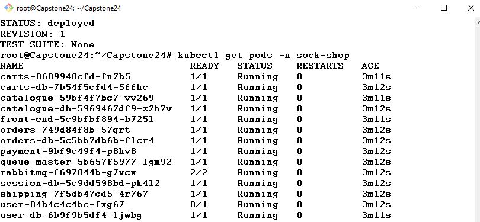
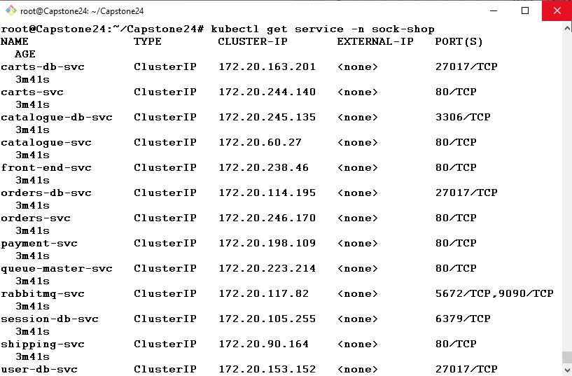
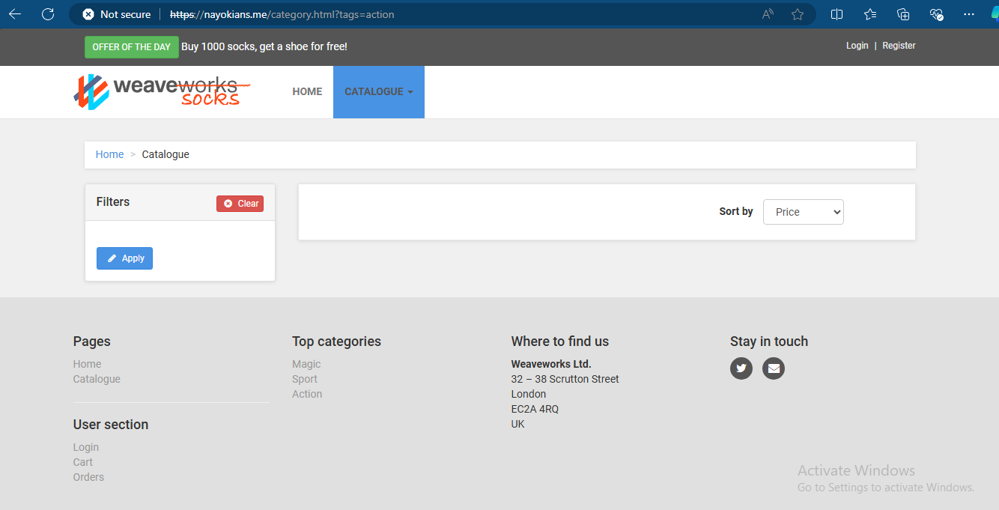
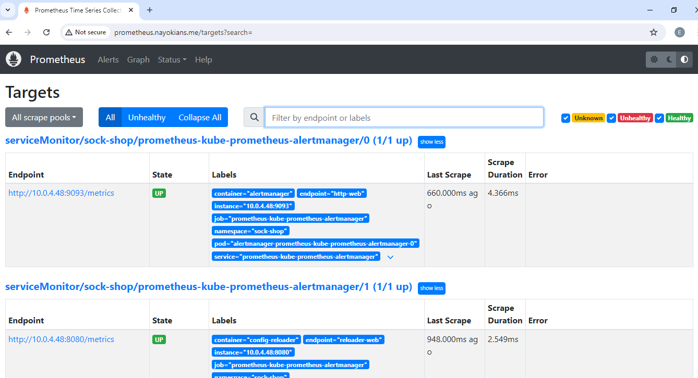

# ARCHITECTURAL DIAGRAM OF INFRASTRUCTURE


<br>
<br>


# SOCK SHOP APP DEPLOY

## Requirements and Prerequisites:

Before beginning the deployment, ensure you have the necessary tools and knowledge. Kubernetes is a powerful container orchestration platform, and you'll need access to an EKS cluster or any Kubernetes provider to run your application. Helm is used for managing Kubernetes applications, while Terraform will help you provision your infrastructure as code. ArgoCD, GitHub Actions, and a Linux server will be essential for CI/CD and overall deployment management.


## Deploying the EKS Cluster

In this stage, you will provision an EKS (Elastic Kubernetes Service) cluster using Terraform. Terraform allows you to define and provision your cloud infrastructure in a declarative way. By navigating to the Terraform directory and running the `terraform apply` command, you'll create the necessary AWS resources for your EKS cluster. This step is crucial as it sets up the foundation for running your Kubernetes workloads.


```bash
terraform init
terraform validate
terraform plan
terraform apply --auto-approve

```


<br>


<br>


## Update kubeconfig File

After provisioning your EKS cluster, you need to update the kubeconfig file, which is a configuration file used by kubectl to access Kubernetes clusters. The aws eks update-kubeconfig command updates this file with the details of your new EKS cluster, enabling you to interact with the cluster using kubectl. This step ensures that your Kubernetes CLI is correctly configured to manage the resources on your new EKS cluster.

```bash
aws eks update-kubeconfig --name socks-shop-EMAPCH75 --region us-west-1
chmod 600 /root/.kube/config
kubectl config current-context
```


## IAM Role Configuration

Sometimes, your IAM role may not be pre-configured to access the EKS cluster resources. This stage involves applying an aws-auth.yaml configuration to grant your IAM role the necessary permissions. Re-running the aws eks update-kubeconfig command ensures that the updates take effect. Proper IAM role configuration is critical to avoid permission-related issues when managing your cluster.

```bash
kubectl apply -f aws-auth.yaml
aws eks update-kubeconfig --name socks-shop-EMAPCH75 --region us-west-1
```

## Create sock-shop Namespace

Namespaces in Kubernetes allow you to organize resources and provide isolation between different environments (e.g., development, testing, production). Here, you'll create a sock-shop namespace, which will house all resources related to the Socky app. This helps in logically grouping resources, making management easier and preventing naming conflicts.

```bash
kubectl create -f sock-shop-ns.yml ## this creates namespace from a yaml file

or

kubectl create namespace sockshop
```

## Checkout Helm Repository

Helm is a package manager for Kubernetes that simplifies the deployment and management of applications. By listing the Helm repositories with helm repo ls, you'll confirm that your repositories are correctly configured, ensuring that you can pull and install the necessary charts. This step sets the stage for the subsequent installation of your application and supporting services.

```bash
helm repo ls
```

## Install CapstoneApp

With the namespace and repositories in place, you're ready to install the CapstoneApp using Helm. Helm charts are collections of pre-configured Kubernetes resources that make it easy to deploy complex applications. This step involves installing the CapstoneApp into the sock-shop namespace and verifying that the application is running successfully. Proper installation ensures that your application components are correctly deployed and operational.

```bash

helm install capstoneapp app --namespace sock-shop

helm list -A

kubectl get pods -n sock-shop

kubectl get service -n sock-shop

```
<br>


## Add and Update Helm Repositories

In this step, you'll add and update Helm repositories, ensuring you have access to the latest charts for additional services like Prometheus and Nginx Ingress. Prometheus is used for monitoring, while Nginx Ingress is used for managing external access to your services. Keeping these repositories up to date is crucial for obtaining the latest stable versions of the Helm charts.

```bash
helm search hub kube-prometheus

helm repo add prometheus-community https://prometheus-community.github.io/helm-charts

helm repo update

helm show values prometheus-community/kube-prometheus-stack >> promvalue

helm repo add ingress-nginx https://kubernetes.github.io/ingress-nginx/

helm repo update

```

## Install Nginx ingress Controller

Nginx is a web server and reverse proxy that is often used as an ingress controller in Kubernetes. By installing Nginx using Helm, you'll be able to manage and route incoming traffic to your services within the sock-shop namespace. This step is essential for exposing your application to the outside world and ensuring that it can handle HTTP/HTTPS requests.

```bash
helm install ingress-nginx ingress-nginx/ingress-nginx --namespace sock-shop

helm list -A

kubectl get pods -n sock-shop

kubectl get service -n sock-shop

```




<br>




## Apply Ingress Configuration

Ingress resources in Kubernetes manage external access to the services within your cluster. In this stage, you'll edit the ingress.yml file to define how traffic should be routed to your front-end service. Applying this file will configure the ingress controller (Nginx) to properly handle requests, enabling users to access your application through a specified URL. A classic ingress is narrated below;

```bash
An example Ingress that makes use of the controller:
  apiVersion: networking.k8s.io/v1
  kind: Ingress
  metadata:
    name: example
    namespace: foo
  spec:
    ingressClassName: nginx
    rules:
      - host: www.example.com
        http:
          paths:
            - pathType: Prefix
              backend:
                service:
                  name: exampleService
                  port:
                    number: 80
              path: /
    # This section is only required if TLS is to be enabled for the Ingress
    tls:
      - hosts:
        - www.example.com
        secretName: example-tls

```

Run the following command to create the ingress and apply front-end service.

```bash
kubectl create -f ingress.yml
```


## Configure Route 53 to Set Up the A Record

Go to the AWS Management Console. Navigate to Route 53 > Hosted Zones. If you have an existing hosted zone, select it. Otherwise, create a new hosted zone for your domain.

### Create an A Record:

1. In the hosted zone, click on Create Record.

1. For Record Name, enter the subdomain or root domain you want to point to the Load Balancer (e.g., www, frontend or sockshop, or leave blank for the root domain). We decided to go with root domain in this project.

1. Select Record Type as A – IPv4 address

1. Choose  Alias and select Yes.

1. In the Alias Target field, select your Load Balancer's DNS name from the drop-down list.

1. Review the settings and click Create records


<br>


<br>

## Access your frontend service using the domain name to ensure the Load Balancer is correctly routing traffic.


<br>


<br>



<br>


<br>

## Install Kube-Prometheus-Stack

The Kube-Prometheus-Stack is a comprehensive monitoring solution that includes Prometheus, Grafana, and Alertmanager. By installing this stack, you'll gain valuable insights into your application's performance, resource usage, and overall health. This stage is crucial for maintaining observability and ensuring that Engineers can quickly respond to any issues in your cluster. It is also very important for this capstone project for Metrics (Alertmanager), Monitoring (Grafana) and Logging (Prometheus) purposes.


```bash

helm install prometheus prometheus-community/kube-prometheus-stack --namespace sock-shop

```


## Edit and Apply Ingress for Prometheus and Grafana

To access the Prometheus and Grafana dashboards, you'll need to update the ingress.yml file to include routes for these services. Applying this file will expose the monitoring tools to the external world, allowing you to visualize metrics and set up alerts. This step ensures that your monitoring stack is easily accessible and configured correctly.


```bash
kubectl apply -f ingress.yml
```



<br>


## Grafana dashboard set up for the project

<br>


<br>


<br>


<br>


## Deploy Let's Encrypt

Let's Encrypt provides free SSL/TLS certificates, which are essential for securing your application's traffic. In this stage, you'll deploy Cert-Manager, a Kubernetes tool that automates the management and issuance of these certificates. Installing Cert-Manager ensures that your application can be accessed securely over HTTPS.


```bash
helm repo add jetstack https://charts.jetstack.io --force-update

helm repo update 

helm install \
  cert-manager jetstack/cert-manager \
  --namespace sock-shop \
  --create-namespace \
  --version v1.15.2 \
  --set crds.enabled=true

```


## confirm installation

helm list -A

kubectl get pods -n sock-shop

kubectl get service -n sock-shop


## Edit Ingress for TLS

To complete the SSL/TLS setup, you'll need to update the ingress.yml file with the certificate details provided by Let's Encrypt. Applying these changes will configure your ingress controller to serve traffic securely. This step is vital for ensuring that all communications between users and your application are encrypted.


```bash

kubectl apply -f ingress.yml

```

## Verify Cert-Manager Components

After deploying Cert-Manager, it's important to verify that all components are functioning correctly. This involves checking that the necessary Custom Resource Definitions (CRDs) are recognized by the cluster and that the certificates have been issued successfully. This step ensures that your TLS certificates are active and that your application is fully secured.


```bash
kubectl get crd | grep cert-manager

```

## Apply the ClusterIssuer and Certificate manifests to get the Let's Encrypt Certificate

```bash
kubectl apply -f clusterissuer.yaml


kubectl apply -f certificate.yml

```


## Confirm that nginx ingress controller is exposing 443 port

```bash
kubectl get svc --all-namespaces | grep ingress-nginx-controller

```


## Confirm the status of the certificate application

```bash
kubectl get clusterissuer


kubectl get certificates -A

```

## Certificate issued and https secure connection established for our webapp domain


<br>


## Configure AlertManager

AlertManager is a component of the Prometheus stack responsible for handling alerts generated by Prometheus. In this stage, you'll configure AlertManager to notify you of any critical issues within your cluster, ensuring that you can quickly respond to potential problems. Setting up AlertManager is key to maintaining the reliability and availability of your application.


